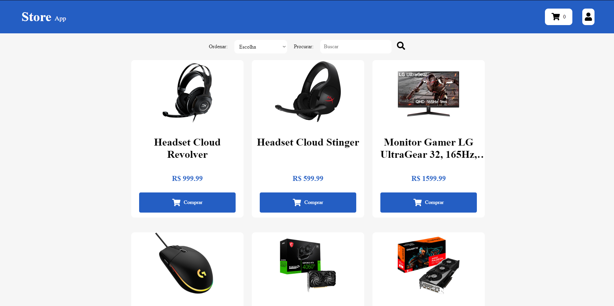
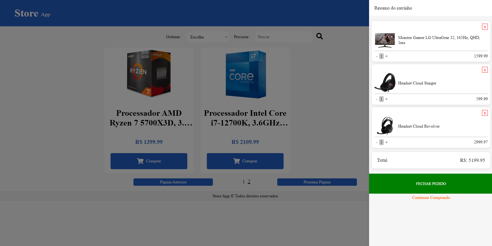
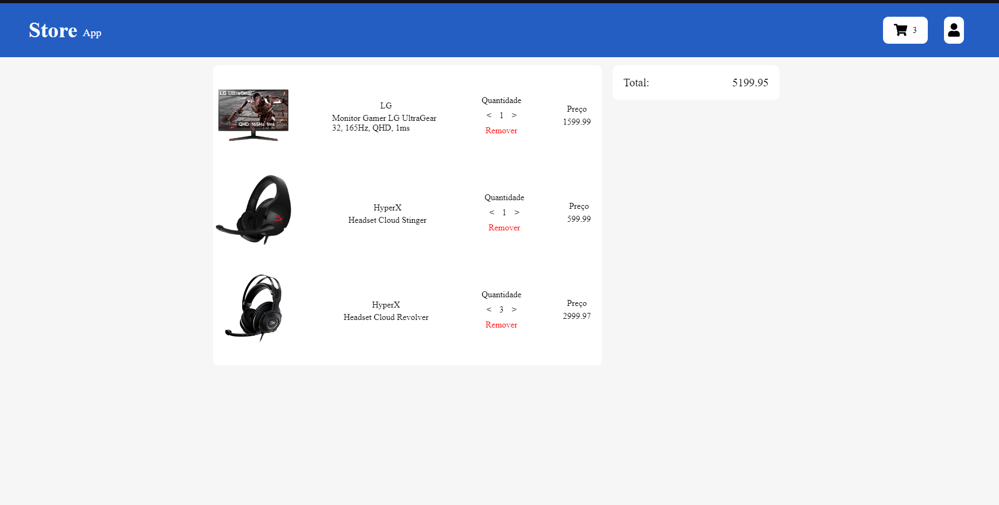

# StoreApp

# Sobre

O StoreApp é um app para a realização de compras do usuario em uma loja virtual.

## Rodando Aplicação

Executando o app:
 - Buildar Container
```bash
  docker-compose build
```
- Iniciar Container
```bash
  docker-compose up -d
```

# Algumas telas do projeto

## Home


## Carrinho lateral


## Página Carrinho

